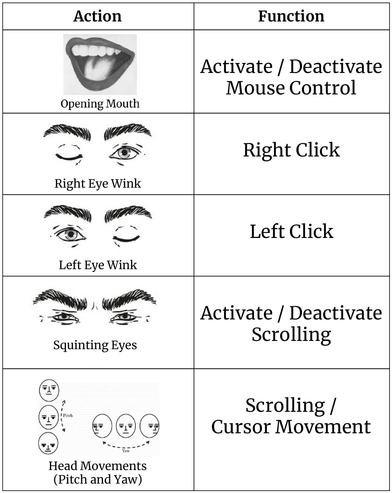
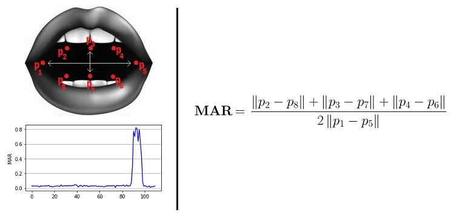

# TechCognize

This HCI (Human-Computer Interaction) application in Python will allow you to control your mouse cursor with your facial movements, works with just your regular webcam. Its hands-free, no wearable hardware or sensors needed.

At this point, you are forced to work with the facial movements I chose but I am working on making them configurable. The list of actions include:

 - Closing your eyes - for controlling the scroll movement
 - Winking - for controlling clicks
 - Moving your head around (pitch and yaw)
 - Opening your mouth (a little bit, yes)
 - Saying 'left' and 'right' for left click and right clicks respectively.

## Code Requirements
* Numpy
* OpenCV
* PyAutoGUI
* Dlib
* Imutils
* Audio files - https://drive.google.com/open?id=12eH3CTVb4tjSmfg8QE7ByzAve_qJA6gH

## Execution
Order of Execution is as follows:

1. Make sure you have the model downloaded. Read the README.txt file inside the model folder for the link. 
2. `python mouse-cursor-control.py`

## Usage
 
I definitely understand that these facial movements could be a little bit weird to do, especially when you are around people.

## How It Works
This project is deeply centered around predicting the facial landmarks of a given face. We can accomplish a lot of things using these landmarks. From detecting eye-blinks in a video to predicting emotions of the subject. The applications, outcomes and possibilities of facial landmarks are immense and intriguing.

[Dlib](dlib.net/)'s prebuilt model, which is essentially an implementation of, not only does a fast face-detection but also allows us to accurately predict 68 2D facial landmarks. Very handy.  

Using these predicted landmarks of the face, we can build appropriate features that will further allow us to detect certain actions, like using the eye-aspect-ratio (more on this below) to detect a blink or a wink, using the mouth-aspect-ratio to detect a yawn etc or maybe even a pout. In this project, these actions are programmed as triggers to control the mouse cursor. [PyAutoGUI](http://pyautogui.readthedocs.io) library was used to control the mouse cursor. 

### Eye-Aspect-Ratio (EAR)
You will see that Eye-Aspect-Ratio is the simplest and the most elegant feature that takes good advantage of the facial landmarks. EAR helps us in detecting blinks and winks etc.  

You can see that the EAR value drops whenever the eye closes. We can train a simple classifier to detect the drop. However, a normal if condition works just fine. Something like this:

    if EAR <= SOME_THRESHOLD:
       EYE_STATUS = 'CLOSE'
    
### Mouth-Aspect-Ratio (MAR)
Highly inspired by the EAR feature, I tweaked the formula a little bit to get a metric that can detect open/closed mouth. Unoriginal - but it works.

Similar to EAR, MAR value goes up when the mouth opens. Similar intuitions hold true for this metric as well. 
